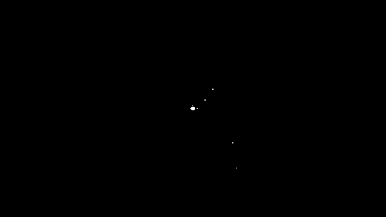
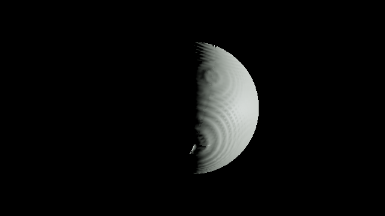
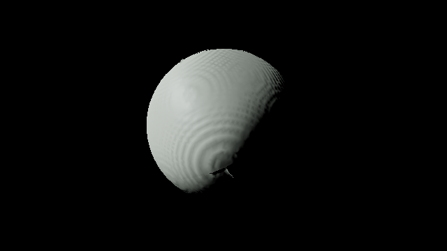

# End to end run against the real hub and compiler

`scripts/e2e.sh` runs the renderer against the real hub and the real system
compiler inside one container. It copies the hub repository to `/tmp/hub`
and starts it with the hub's own harness (`scripts/e2e/hub-up.sh`: Redis, a
SeaweedFS S3 gateway, Postgres, the hub, and its seed), clones the system
compiler to `/tmp/compiler`, builds it and runs `system-compiler serve`
with the credentials from `/tmp/gx-e2e.env`, builds `gx-renderer` and
`tools/png-stats` in release mode, takes four headless screenshots at
640 x 360, checks them, and stops everything. The hub database and object
store are reset first, so every chunk is compiled during the run. Every
service listens on loopback only; the ids the hub prints (compiler, build)
are random per run.

The renderer learns nothing from the run: the only inputs are the view
flags below, and every other number comes from the registry the hub serves.

## Recorded run

| | |
|---|---|
| Date | 2026-10-05 |
| Hub commit | `88679d183ead901aa0d8b704bbcb0371e9cd95b9` |
| Compiler commit | `02e9e959d4fdcb2514fb85905a5511bddd492687` (branch `grunt`) |
| Core revision | `331ae53b12af71ea72d6e1d5dfe64f104df1a05b` (`Cargo.lock`) |
| Renderer | `df59a452eef9ac792656a13d1005d8941e95561f` plus the change that closes the cell seams and adds `--exposure-stops` |
| Graphics adapter | llvmpipe (software Vulkan) |
| Command | `sh scripts/e2e.sh` |
| Exit status | 0: 13 assertions passed, 0 failed |

The statistics below are from that run.

## Screenshots

Each screenshot is matter only (`--no-overlay`: no overlay text, frame
markers, or lines), waits until every cell it selected and every pinned far
field cell is ready (`--wait-ready-seconds 300`, which exits non-zero on
timeout), and writes its overlay statistics (`--stats-json`, the `.json`
file beside each image).

| File | Flags | What it is |
|---|---|---|
| `home.png` | `--view home --exposure-stops 25.95` | the `Home` view of the whole system at launch time, at a fixed exposure (below) |
| `frame-3.png` | `--view 3` | the view number key 3 jumps to (the third non-root frame by ascending id) at launch time |
| `frame-3-plus-90d.png` | `--view 3 --start-offset-seconds 7776000` | the same view 90 days (7776000 s) after the epoch |
| `frame-1-close.png` | `--view 1 --view-distance-scale 0.25` | number key 1's view at a quarter of its distance |

Only `home.png` uses a fixed exposure; the other three adapt automatically.

A number key view looks at its frame from above, along root `-z` with root
`+y` up, from `3 * root_extent / 8` (`docs/controls.md`). Because that
direction is fixed in root axes, the lit side of frame 3 turns as the frame
moves around the hot frame over the 90 days.






### The cell seams

Before this run each cell's grid was padded with one layer of vacuum
(`src/extract.rs`), so matter that filled a cell to its boundary ended in a
wall at the cell face, and two filled neighbors met wall to wall. The walls
were lit edge-on, and the previous `frame-3.png` showed them as dark creases:
one running top to bottom through the lit side, and one across it, meeting
near the lower left of the lit part.

The padding now takes the first layer of samples of the neighbor across the
face when that cell is `Ready` at the same depth, the neighbor's vacuum when
the hub holds no matter for it (`Empty`), and otherwise repeats the cell's
own boundary samples outward (`docs/architecture.md`, the padding rule). A
density that continues across a face has no isosurface crossing there, so no
wall is emitted. A cell is extracted again when a face neighbor arrives, so
the seams close as cells stream in.

In the new `frame-3.png` and `frame-3-plus-90d.png` both creases are gone:
the lit part is one continuous surface from the limb to the terminator, and
the largest component above luma 32 grew in `frame-3.png` from 5.83 to 7.11
percent of the image while the component count fell from 15 to 9. The same
8 meshes now hold 21494 triangles instead of 41008: the walls at the cell
faces were about half of them. What remains visible: the concentric ripples
on the surface, which are the sample quantization of the compiled density
and were there before; and a small notch, about 10 px, at the lower end of
the lit edge near (320, 245), near the frame's pole. It was not traced to a
single cell; the likely cause is a depth transition there, where neighbors at
another depth clamp instead of padding with their samples (the accepted step
of the padding rule).

## Fixed exposure of `home.png`

Automatic exposure adapts to the brightest matter in view. At the `Home`
view the one hot frame (frame 1) delivers about 0.165 W m^-2 to the camera
and the cold frames between 2.9e-13 and 1.4e-10 W m^-2 (`home.json`,
`sprites`), so at the automatic exposure every cold frame quantizes to
black. That is what a camera with that exposure sees, so the D4 assertion of
9 blobs at the automatic exposure was wrong, not the renderer.

`--exposure-stops <s>` fixes the exposure at `0.18 * 2^s / (1 W m^-2 sr^-1)`
m^2 sr W^-1 before the tone curve: `s` stops relative to the automatic
exposure of a scene whose log-average luminance is exactly 1 W m^-2 sr^-1
(`docs/shading.md`, fixed exposure). `scripts/e2e.sh` computes `s` so that a
sprite delivering `E = 5e-13 W m^-2` lands on middle grey: the sprite is a
disc 2 px across at that irradiance, so its radiance is `E f^2 / (pi 1^2)`
with `f = 360 / (2 tan 30 deg)` px, and `s = log2(1 / radiance) = 25.95`.
The script prints it:

```
exposure: home.png at 25.95 stops, a sprite of 5e-13 W m^-2 at middle grey
```

Why 5e-13 W m^-2 and not the 4.5e-9 W m^-2 the task named: 4.5e-9 W m^-2
was the D4 upper bound for the brightest cold frame (albedo 1, its whole
`root_extent / 8` disc fully lit and facing the camera). The irradiances the
renderer actually computes from the served registry and depth-0 cells are
much lower: the four frames that project 24 px or more from the hot frame
(6, 7, 8, 9) deliver 1.4e-10, 2.9e-11, 1.9e-12, and 6.4e-13 W m^-2. With
4.5e-9 W m^-2 at middle grey (about 12.8 stops) frame 9 would sit 12.8
stops below middle grey and quantize to black. 5e-13 W m^-2 is frame 9,
rounded down, so all four sit at or above middle grey. (A cold frame now
reflects as a Lambertian ball with a phase function rather than a disc
facing the light, `docs/shading.md`, far field; the irradiances above are
from that model.) At this exposure the
hot frame saturates, and the frames that project within 7 px of the center
merge with it or show as their own small dots.

## Assertions

`tools/png-stats` measures luma (`0.2126 R + 0.7152 G + 0.0722 B` of the
8-bit values, 0 to 255). Output of the recorded run:

```
PASS screenshot home.png: every selected cell ready
PASS screenshot frame-3.png: every selected cell ready
PASS screenshot frame-3-plus-90d.png: every selected cell ready
PASS screenshot frame-1-close.png: every selected cell ready
PASS blobs home.png: 7 components above luma 32 of at least 1 px (need 5), sizes [4, 4, 2, 35, 4, 4, 3], centroids [(352.5, 147.5), (339.5, 165.5), (318.5, 175.0), (319.2, 179.5), (326.5, 179.5), (385.5, 236.5), (391.7, 278.3)], largest 0.3 px from the center (need at most 8)
PASS disc frame-3.png: largest of 9 components above luma 32 covers 7.11 percent (need 5 to 60), centroid (373.0, 180.4), brighter side mean 194.7, darker side mean 117.2, ratio 1.66 (need 1.2), lit toward (1.00, -0.03)
PASS disc frame-3-plus-90d.png: largest of 13 components above luma 32 covers 11.32 percent (need 5 to 60), centroid (295.4, 161.7), brighter side mean 183.2, darker side mean 116.9, ratio 1.57 (need 1.2), lit toward (-0.97, -0.25)
PASS moved frame-3.png -> frame-3-plus-90d.png: bright centroid (372.7, 180.7) over 16467 px -> (295.6, 161.9) over 26184 px, shift 79.4 px (need 16)
PASS smooth frame-1-close.png: luma p1 77.4 p99 190.2, range 112.8 (need 32), largest neighbor step 1.7 at (350, 81), 0.015 of the range (need at most 0.25)
PASS size home.png: 1893 bytes (limit 307200)
PASS size frame-3.png: 28679 bytes (limit 307200)
PASS size frame-3-plus-90d.png: 35699 bytes (limit 307200)
PASS size frame-1-close.png: 42677 bytes (limit 307200)
e2e: 13 passed, 0 failed
```

What each check means:

- **blobs**: at the fixed exposure, 8-connected components of pixels above
  luma 32: at least 5 (the hot frame saturated at the center plus the four
  frames that project 24 px or more from it), and the largest component is
  the hot frame's, its centroid within 8 px of the image center. The run
  found 7: the hot frame (35 px, 0.3 px from the center), frames 6 to 9 at
  the positions the script prints below, and two of the frames near the
  center (frame 5 at (326.5, 179.5), and frames 4 and 10 together at
  (318.5, 175.0)) as separate small dots.
- **disc**: the largest component above luma 32 covers 5 to 60 percent of
  the image, and it leans to one side. It is split by the line through its
  centroid perpendicular to the offset of its luma-weighted centroid, and the
  brighter half must be at least 1.2 times as bright as the darker half. A
  disc lit face on has no lean and a ratio of 1. The unlit half of the disc
  is black like the background, so the component is the lit part.
- **moved**: the centroid of the pixels above luma 32 moves at least 16 px
  between the two views of frame 3. It moved 79.4 px: the lit side turned
  from the right (`lit toward (1.00, -0.03)`) to the left
  (`(-0.97, -0.25)`), so simulation time advanced the frames.
- **smooth**: the luma falls by at least 32 levels across the image and no
  step between neighboring pixels exceeds a quarter of that fall. The close
  view of frame 1 is drawn by 198 volumes and no surface; its largest step is
  1.7 levels over a range of 112.8.

Where each frame projects in `home.png`, from the registry the hub served
(positions at the epoch, a child's added to its parent's), as the script
prints it:

```
home: frame 1 projects to (-0.04, +0.01) px from the image center, 0.04 px away
home: frame 2 projects to (-0.68, +2.00) px from the image center, 2.11 px away
home: frame 3 projects to (-3.61, +0.24) px from the image center, 3.62 px away
home: frame 4 projects to (-0.92, -4.43) px from the image center, 4.53 px away
home: frame 5 projects to (+6.89, +0.01) px from the image center, 6.89 px away
home: frame 6 projects to (+20.24, -13.85) px from the image center, 24.53 px away
home: frame 7 projects to (+33.07, -31.90) px from the image center, 45.95 px away
home: frame 8 projects to (+65.86, +57.11) px from the image center, 87.17 px away
home: frame 9 projects to (+72.34, +98.93) px from the image center, 122.56 px away
home: frame 10 projects to (-0.93, -4.42) px from the image center, 4.52 px away
```

## Statistics

From `--stats-json` (the overlay statistics of the rendered frame).
`selected` is the cell selection; `pinned` are the depth-0 cells kept for
far field sprites; `requests` counts every chunk request, including the
`202` answers; `fetched` counts requests answered `200` with a chunk body;
`bytes` is the body bytes received; the round trips are of the first and of
the latest request; `streamed` is the wall time from the selection to the
draw.

| Screenshot | Selected | Pinned | Requests | Fetched | Bytes | First round trip | Last round trip | Streamed |
|---|---|---|---|---|---|---|---|---|
| `home.png` | 1 | 10 | 22 | 11 | 2289 | 0.0159 s | 0.0367 s | 10.2 s |
| `frame-3.png` | 513 | 9 | 1034 | 522 | 97865 | 0.0094 s | 0.0073 s | 10.4 s |
| `frame-3-plus-90d.png` | 513 | 9 | 942 | 522 | 97865 | 0.0057 s | 0.0052 s | 10.4 s |
| `frame-1-close.png` | 513 | 9 | 1034 | 522 | 958810 | 0.0051 s | 0.0187 s | 19.1 s |

Draw counts: `home.png` 10 sprites and 1 light; both views of frame 3 have 8
meshes (21494 triangles), 9 sprites, and 1 light; `frame-1-close.png` has
198 volumes, 9 sprites, and 1 light.

Every screenshot streamed for about 10 s, and the requests are about twice
the fetched cells. A cell the hub had not compiled yet is answered `202`.
The renderer then subscribes to it on the readiness socket, but the
compiler stores most sections within 100 ms, often before the subscription
arrives. Those pushes never come, so the cell is polled once its 10 s push
wait (`stream::PENDING_POLL_AFTER_SECONDS`) is over. The compiler stored
1456 sections during the run.

## Upstream observation, not blocking

The hub logs an unhandled exception each time a renderer process exits
with its readiness socket open (in each run):

```
fail: Microsoft.AspNetCore.Diagnostics.DeveloperExceptionPageMiddleware[1]
      An unhandled exception has occurred while executing the request.
      System.Net.WebSockets.WebSocketException (0x80004005): The WebSocket is in an invalid state ('Aborted') for this operation. Valid states are: 'Open, CloseReceived, CloseSent'
         at System.Net.WebSockets.ManagedWebSocket.CloseAsync(WebSocketCloseStatus closeStatus, String statusDescription, CancellationToken cancellationToken)
         at ThreeGixHub.Controllers.ChunkSubscriptionController.ReceiveLoopAsync(WebSocket socket, Guid buildId, CancellationToken cancellationToken) in /tmp/hub/3GIXHub/Controllers/ChunkSubscriptionController.cs:line 75
```

The receive loop answers a close frame with `CloseAsync` after the client
has already gone. It only affects the hub's log; every request in the run
was answered.
